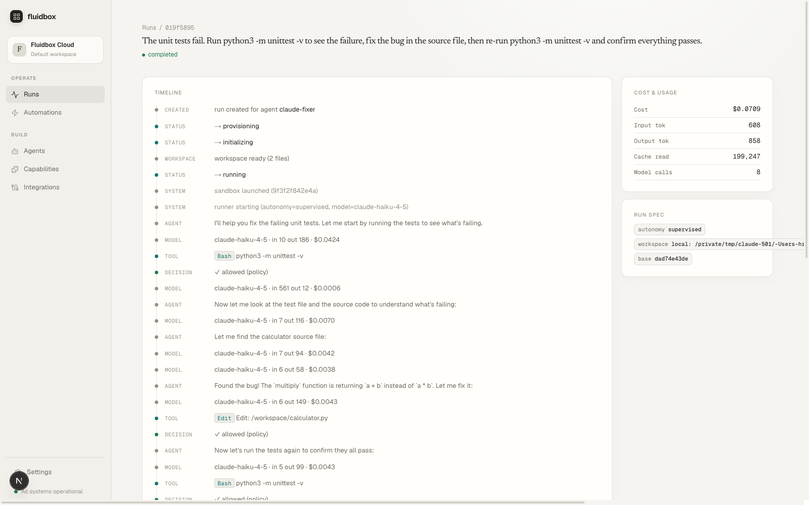

# fluidbox 🧊

**Run AI coding agents in governed, disposable sandboxes — with policy, human approvals, an append-only audit trail, and cost control.**

[](https://github.com/hrishikeshdkakkad/fluidbox/actions/workflows/ci.yml)
[](./LICENSE)
[](./crates)
[](./CONTRIBUTING.md)

Coding agents are powerful and unaccountable: they run with your credentials, on your machine, with no record of what they did or why. **fluidbox** is an open-source control plane that fixes the accountability half without giving up the power. You register a versioned **agent definition** (harness, model, system prompt, policy, budgets), then start **runs** of it. Every run:

1. **Freezes an immutable `RunSpec`** — model, prompt, policy snapshot, capability pins — so the audit trail can be trusted even after agents and policies change.
2. **Gets a fresh, egress-free sandbox** with a bind-mounted copy of your repo. Your API keys, git credentials, and OAuth tokens **never enter the sandbox** — the control plane brokers every credentialed action.
3. **Streams a live event timeline** over SSE while every tool call passes through a policy gate: allow, deny, or **pause for human approval** (or auto-decide under stricter guardrails in autonomous mode).
4. **Ends with a diff and a cost report**, backed by an append-only, redaction-enforced ledger — prompts never touch the database, only digests, usage, and decisions.



*A real run: the agent fixes a failing test inside a sandbox while every `Bash` and `Edit` call passes the policy gate, with cost metered per model call.*

## What's inside

- **Policy engine** — YAML rules evaluated per tool call, with policy snapshots frozen per run and both original and rewritten verdicts recorded in autonomous mode.
- **Human-in-the-loop approvals** — idempotent, restart-safe, with expiry; the permission callback stays wired in every autonomy mode.
- **Two harnesses** — Claude Agent SDK and Codex, behind one runner contract; adding a harness is a new runner image plus one registry arm.
- **Credential inversion everywhere** — the sandbox's `ANTHROPIC_API_KEY` is a session token validated by an in-server LLM facade that meters usage and enforces budget stops; git fetches and brokered MCP tools run control-plane-side with sealed-at-rest credentials.
- **Triggers & schedules** — subscription-scoped API tokens, signed webhook ingress, cron schedules with exactly-once firing, and HMAC-signed result delivery with retries.
- **GitHub integration** — seamless GitHub App connect, PR fan-out (one stable comment per PR, one check per head SHA), and fork PRs frozen to read-only with no approval escape hatch.
- **Capability catalog** — versioned MCP tool bundles, pinned at run creation: sandbox tools run as contained stdio subprocesses, brokered tools execute on the control plane with credentials the sandbox never sees.
- **Connector catalog + OAuth** — connect external services with PKCE, resource indicators, and dynamic client registration; refresh tokens sealed at rest with atomic rotation.
- **Dashboard** — a Next.js UI (presentation-only; all logic lives in the Rust API).

## Quickstart

Prerequisites: [Rust](https://rustup.rs) (stable), [Docker](https://docs.docker.com/get-docker/), [just](https://github.com/casey/just), [pnpm](https://pnpm.io), and a free [Neon](https://neon.tech) Postgres database.

```bash
git clone https://github.com/hrishikeshdkakkad/fluidbox.git
cd fluidbox
cp .env.example .env        # fill in DATABASE_URL, ANTHROPIC_API_KEY, tokens
just neon-setup             # or bring your own Postgres (direct connection string)
just sandbox-build          # build the sandbox runner image
just dev                    # LiteLLM gateway + Rust server + dashboard
```

Then open <http://localhost:3000>, or drive a run from the CLI:

```bash
cargo run -p fluidbox-cli -- run --repo /path/to/repo --task "fix the failing test"
```

Every knob is documented inline in [`.env.example`](./.env.example).

## Architecture

```
            ┌────────────────────────── control plane (Rust) ──────────────────────────┐
 dashboard  │  /v1 public API   orchestrator   policy engine   approvals   SSE stream  │
 CLI ─────▶ │  /internal gateway ◀── permission checks, events, heartbeats, results    │
 webhooks   │  /internal/llm facade ◀── budget stop, metering, credential swap         │
            └───────────▲──────────────────────────────┬──────────────────────────────┘
                        │ runner contract              │ brokered tools, git fetch,
            ┌───────────┴───────────┐                  │ LiteLLM → model providers
            │  disposable sandbox   │                  ▼
            │  (agent harness, no   │           sealed credentials
            │  real credentials)    │           (never enter a sandbox)
            └───────────────────────┘
```

- [`docs/ARCHITECTURE.md`](./docs/ARCHITECTURE.md) — how a run flows, the security model, and the extension seams.
- [`PLAN.md`](./PLAN.md) — the authoritative design document: north star, convergence invariants, milestones.

### Repository layout

```
crates/fluidbox-core       pure domain: policy engine, events, state machine, traits
crates/fluidbox-db         sqlx repositories, migrations, LISTEN/NOTIFY
crates/fluidbox-provider   DockerProvider (Lambda MicroVM provider is next)
crates/fluidbox-server     axum API + SSE + orchestrator + LLM session facade
crates/fluidbox-cli        the `fluidbox` command
apps/web                   Next.js dashboard
images/sandbox-runner      Claude Agent SDK runner image
images/codex-runner        Codex runner image (second harness)
images/runner-lib          shared runner-contract client
deploy/                    docker-compose + LiteLLM config
migrations/                SQL migrations (embedded; run automatically on boot)
policies/                  seed policy YAML
```

## Status

fluidbox is **early and moving fast**, but everything described above is implemented and covered by an end-to-end acceptance suite (`just e2e`): governed live runs, approvals, git workspaces, API/webhook/schedule triggers, GitHub PR fan-out, capability catalog, connector OAuth, and both harnesses. Up next on the [roadmap](./PLAN.md#7-milestones): the AWS Lambda MicroVM execution provider and bring-your-own-cloud.

Expect breaking changes before a tagged release; the [changelog](./CHANGELOG.md) tracks what's landed.

## Contributing

Contributions are welcome — bug reports, docs, and code. Start with [CONTRIBUTING.md](./CONTRIBUTING.md) for the dev setup and the quality bar (`just check` and, for governance-path changes, `just e2e`). Architectural changes must preserve the convergence invariants in [`PLAN.md` §2](./PLAN.md).

Found a security issue? Please **don't open a public issue** — see [SECURITY.md](./SECURITY.md).

## License

[MIT](./LICENSE) © fluidbox contributors.
