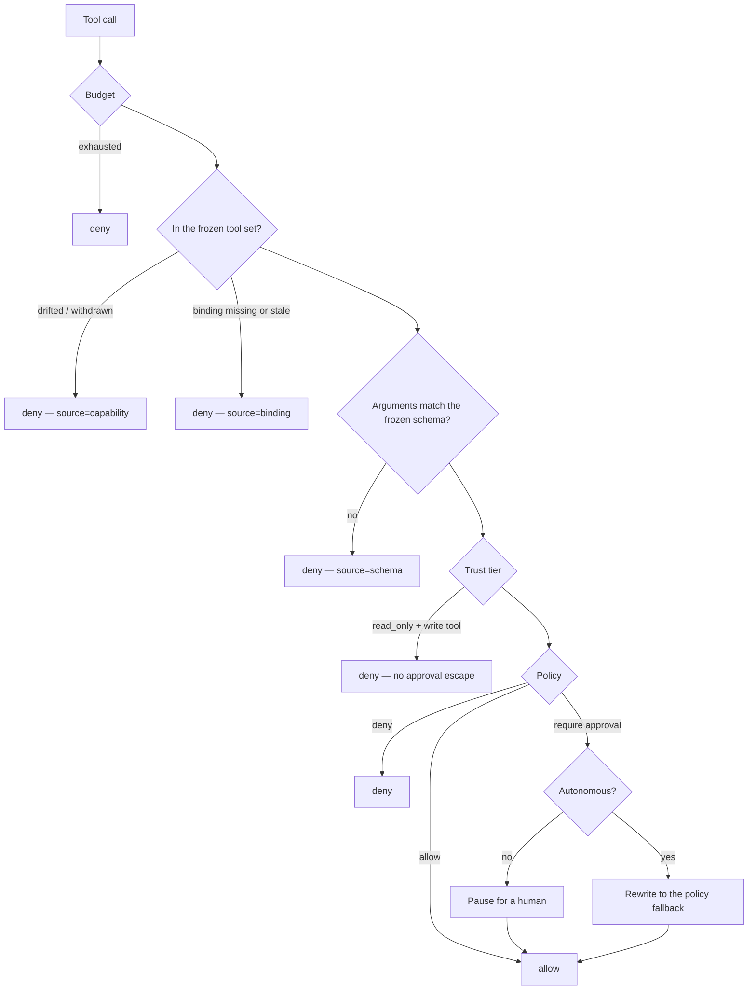

# The permission gate

There is exactly one place in fluidbox where "can this happen?" is answered.
Every tool call — from the model's own `Bash` to a brokered MCP call reaching a
customer's Jira — passes through it, and the **order of its stages is the
security model**.

## The sequence



Each stage exists because the one after it cannot be trusted to catch that
class of problem.

### 1. Budget

Cheapest check first. A run that has spent its allowance stops before anything
else is evaluated.

Admission books a **durable, request-keyed reservation** rather than checking a
running total, because two concurrent requests can each read a total that is
under budget and both proceed. The reservation's primary key becomes the usage
entry's external id, which is what makes a retry or a late drain idempotent.

The booking is deliberately pessimistic — the declared maximum output plus a
genuine upper bound on input tokens — and is reconciled against real usage when
the response drains.

### 2. Frozen tool set

The run froze the exact set of tools it may call, including a digest.

If an upstream MCP server later changes its tools — adds one, withdraws one,
changes a signature — the call is **denied** rather than silently
re-negotiated. This is the rug-pull defence: the surface a human approved when
the run started is the surface the run gets.

Two denial sources distinguish the cases:

- `source=capability` — the tool is not in the frozen set, or the set drifted.
- `source=binding` — the binding to the connection is missing or stale.

Re-photograph a connection with `POST /v1/connections/{id}/tools/refresh` and
start a *new* run; existing runs keep what they froze.

### 3. Frozen argument schema

Arguments are validated server-side against the schema frozen at run creation.

The schema is **untrusted input** — it came from an external MCP server — so it
is pre-guarded before compilation: bounded size, bounded depth, and every
`$ref` must be local. A schema that violates those bounds makes the tool
**un-callable** rather than being quietly ignored, which is the fail-closed
choice.

A denial here is rendered to the model as a *tool execution error*, never as a
protocol error, so the model can correct itself and try again.

### 4. Trust tier

A run from an untrusted source freezes `trust_tier: read_only`. In practice
that means **any pull request from a fork** — and the check fails *toward*
"fork" when the head repository is hidden.

A `read_only` run may read and review but never write or reach for secrets, and
this is enforced **above policy and above human approval**. There is no
approval escape from this tier: nobody can click "allow" past it.

This is the stage that makes it safe to run an agent against a pull request
from a stranger.

### 5. Policy

The run's **frozen policy snapshot** — not the policy's current content.

Editing a policy affects only future runs. This is what makes the audit trail
trustworthy: you cannot retroactively make a past run look compliant by
loosening a rule today.

Policies produce one of three verdicts: `allow`, `deny`, or `require_approval`.

### 6. Approval

A `require_approval` verdict pauses the run in `awaiting_approval` and emits an
`approval.requested` event.

**Idempotent by `(session_id, tool_call_id)`.** The database row is the source
of truth; an in-memory notification only wakes a blocked handler early. On a
restart the runner's retry re-attaches to the pending row — nothing duplicates
and nothing hangs.

The decision is settled by a compare-and-swap, and the resulting
`approval.decided` and `tool.decision` events are appended **inside the
deciding transaction**. Only the winner emits; waiters emit nothing. One
consequence worth knowing: a failure to append the ledger entry rolls the
*decision* back. That is fail-closed on purpose.

#### Who may decide

Authority is not uniform. A call against a **personal** connection is decidable
only by the owner who invoked it — with no role, admin, or operator override,
symmetric across approve and deny.

The reasoning is that a personal connection is one human's custody of their own
credential. An administrator being able to approve its use would make "personal"
meaningless.

---

## Autonomous mode is not a bypass

This is the point most often misread.

The permission callback stays wired in **both** autonomy modes. fluidbox never
uses the agent SDK's own permission-bypass mode.

What autonomy changes is one thing: a `require_approval` verdict is rewritten
to the policy's fallback *inside the evaluation*, and **both** the original and
the rewritten verdict are recorded in the ledger. Every other stage — budget,
frozen set, schema, trust tier, policy — runs identically.

So an autonomous run against a fork pull request still cannot write. And the
record still shows exactly what a human *would* have been asked.

---

## What the ledger records

Per tool call:

```
tool.requested  →  tool.decision  →  tool.brokered
```

`tool.brokered` carries latency and a digest of the result — **never payloads
and never secrets**.

More broadly, the ledger only accepts *redacted* envelopes, and that is
enforced by the type system rather than by convention: the redacted type is
constructible only through the redactor. Model prompts never reach the ledger.
Only digests, usage, and cost do.

`seq` is assigned server-side, gaplessly, under a row lock — which is what
makes both timeline catch-up and stream resume exact.

---

## Two tool classes, and why the split *is* the model

fluidbox has exactly two classes of tool, and the boundary between them is a
security boundary rather than a packaging convenience.

**Sandbox tools** are stdio subprocesses packaged in the runner image. They
hold no credential and are contained by the container. Register these as
[capability bundles](./capabilities.md).

**Brokered tools** are called **by the control plane**, with a sealed
credential that never enters a sandbox. The sandbox sends intent and receives a
governed result.

That is the same inversion used for model access (the sandbox's API key is its
session token) and for git (the credentialed fetch happens control-plane-side).
In all three cases the sandbox is the untrusted party and never holds the
secret.

Attaching a tool is not the same as allowing it. Attachment puts a tool in the
frozen set; the gate still decides every individual call.

Before any brokered secret is touched, the binding is re-verified — status,
authorization generation, and for personal connections the owner's membership
being active — and it fails closed. An authorization generation bump (a
reconnected OAuth connection) makes in-flight bindings refuse mid-run.

---

## Related

- [Policies](./policies.md) — authoring the rules
- [Capabilities](./capabilities.md) — sandbox tool bundles
- [API reference](../api/openapi.yaml) — the permission endpoint itself
