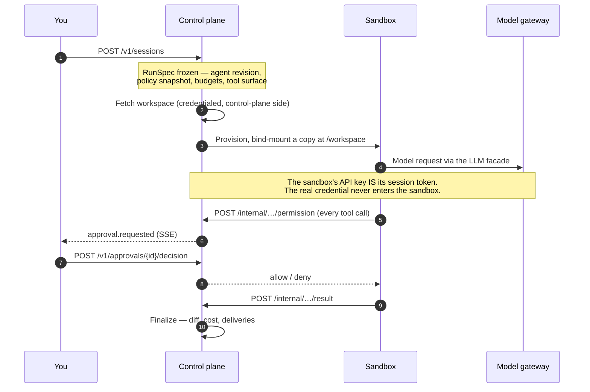

# fluidbox

**Run AI coding agents in governed, disposable sandboxes.**

fluidbox is a control plane. You register a versioned *agent definition*; each
*run* freezes an immutable specification, provisions a fresh sandbox, streams a
live event timeline, pauses for human approval — or auto-decides in autonomous
mode — and ends with a diff and a cost report.

The point is not that an agent can write code. The point is that you can hand
one a repository and a credential and still be able to answer, afterwards,
exactly what it did and why it was allowed to.

---

## Start here

| I want to… | Go to |
| --- | --- |
| Start a run in five minutes | [Quickstart](./guides/quickstart.md) |
| Understand which credential to use | [Authentication](./guides/authentication.md) |
| Understand what an agent is allowed to do | [The permission gate](./guides/governance.md) |
| Build my own agent harness | [Building a harness](./guides/runner-contract.md) |
| Look up an endpoint | [API reference](./api/openapi.yaml) |

---

## How a run flows



---

## The five ideas worth knowing before you integrate

### 1. The specification is frozen at run creation

A run captures its agent revision, a **full policy snapshot**, the resolved
workspace, budgets, and the exact tool surface — and is judged against that
snapshot for its whole life. Editing an agent or tightening a policy affects
only *future* runs.

This is the property that makes the audit trail worth having. A run's record
cannot be retroactively made to look compliant.

### 2. Agents are append-only

"Editing" an agent means appending a revision. Revisions are never mutated.

There are also two distinct prompts, and conflating them is the most common
modelling mistake: the **system prompt** lives on the revision (who the agent
is), while the **task** is supplied per run (what to do this time).

### 3. Credentials never enter a sandbox

Three separate inversions enforce the same rule:

- **Model access** — the sandbox's `ANTHROPIC_API_KEY` *is its session token*.
  The facade validates it, swaps in the real upstream credential, and meters
  the streamed response.
- **Brokered tools** — credentialed MCP servers are called *by the control
  plane*. The sandbox sends intent and receives a governed result.
- **Git** — the credentialed fetch happens control-plane-side before the agent
  starts. The agent only ever sees a bind-mounted copy, and the sandbox itself
  stays egress-free.

### 4. Every tool call passes one gate

There is exactly one place where "can this happen?" is answered, and it runs a
fixed sequence: budget → frozen tool set → frozen argument schema → trust tier
→ policy → approval. See [the permission gate](./guides/governance.md).

The gate stays wired in autonomous mode too. Autonomy rewrites a
*require approval* verdict to the policy fallback and records both verdicts —
it is not a bypass.

### 5. Delivery is decoupled from the run

Results are delivered by a separate signed, retrying worker. A failing webhook
or an unreachable GitHub can never mutate a run. Delivery is at-least-once, so
receivers deduplicate on the `x-fluidbox-delivery` header.

---

## The four planes

The HTTP surface is four audiences with four different credentials. Mixing
them up is the most common integration mistake.

| Plane | Base path | Who calls it | Credential |
| --- | --- | --- | --- |
| Public API | `/v1` | Your code, the CLI, the dashboard | Admin token, PAT, or session cookie |
| Runner contract | `/internal` | Only the in-sandbox runner | Audience-scoped session token |
| Operator | `/v1/admin` | Break-glass tooling | Admin token only |
| Ingress | `/v1/ingress` | GitHub and other services | Webhook signature |

On Kubernetes the runner contract is served on a **separate listener** and
`/internal` does not exist on the public one at all — route absence is a
stronger boundary than bearer authentication.

---

## Errors

One shape, everywhere:

```json
{ "error": "agent not found" }
```

There is one deliberately stable machine code: `wrong_audience`, returned when
a sandbox token is used against a route outside its audience. Runners key their
fatal abort on that exact string.
