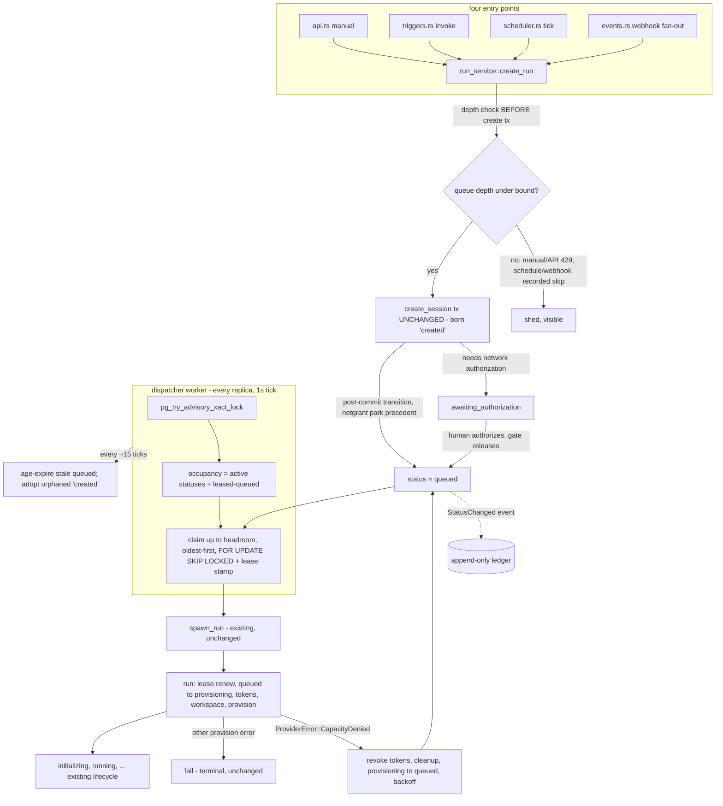
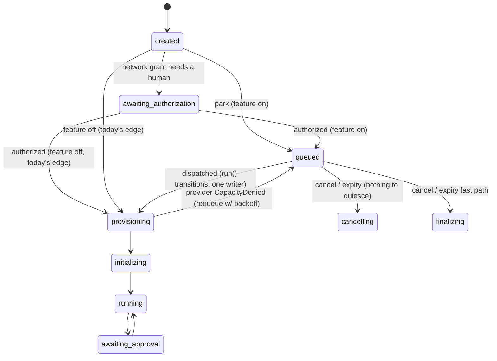

# Run admission & queueing — capacity control for sandbox-backed runs

> **Status:** proposed design, not implemented · **Date:** 2026-08-23 · **Verified against:** `main` @ `7b51ce2` (v0.8.0)
> **Supersedes:** the discarded 2026-07-25 capacity-scheduling design (not read while producing this one, per the handover's §0 exclusion; see §15).

---

## 1. Executive summary

**Target scale: ≤300 concurrent runs, low-thousands of run starts per hour, 2–3 control-plane replicas, ≤~20 tenants.** That is the 12-month ceiling from the handover's scale envelope, and it matches the deployment's own committed capacity planning: the Helm chart's quota comment (`deploy/helm/fluidbox/values.yaml`) cites "30–60 concurrent sandboxes is the normal 300-seat load, 300 is the full-seat stress case" from `docs/plans/2026-07-14-multi-user-mcp-control-plane-design.md`, and the Phase-F pool sizing (`crates/fluidbox-db/src/lib.rs:138-144`) was already chosen against a 300-concurrent-run target. Everything below is justified against that number and nothing larger. 10k+ is explicitly out of scope.

**The problem.** Today every entry point converges on `run_service::create_run`, which ends in a bare detached `tokio::spawn` (`orchestrator.rs:144-151`). There is no admission check anywhere. The only quantity gate is the Kubernetes namespace `ResourceQuota`, which rejects pod creation with a 403 and the run **fails terminally** — no hold, no retry. The ecosystem is unanimous that this is backwards: Kubernetes' own controllers treat a quota 403 as retryable capacity pressure, never a workload failure ([resource-quotas docs](https://kubernetes.io/docs/concepts/policy/resource-quotas/)), and Kueue — the reference batch-admission project — exists precisely to hold work *before* the cluster sees it ([Kueue overview](https://kueue.sigs.k8s.io/docs/overview/)).

**The proposal.** One new session status, `queued`, parked exactly like `awaiting_authorization` (pre-provisioning, pre-token, pre-budget); one dispatcher worker per replica (the `network_grant_gate` shape, `workers.rs:901`) that admits queued runs FIFO under a configured deployment-wide cap; a **serialized dispatch decision** (a transaction-scoped `pg_try_advisory_xact_lock`) with occupancy **derived by counting session rows** — no counter to drift; claims made with `FOR UPDATE SKIP LOCKED` that stamp the existing orchestrator lease (migration 0021), so a crashed claimant's rows return to the pool in 30 s by machinery that already exists. The queue is bounded in depth (429 / recorded skip past it) and in age (a sweeper fails runs queued too long). A provider quota 403 is classified as `CapacityDenied` and re-parks the run with backoff instead of failing it. Everything is audit-visible through the existing `StatusChanged` ledger funnel — **zero new event types**, zero new tables, four new columns on `sessions`, one migration.

**Inert by default.** `FLUIDBOX_MAX_CONCURRENT_RUNS` unset ⇒ byte-identical current behavior: runs are born `created` and spawn directly; no dispatcher runs; the migration's columns sit unused. Stage 1 is one engineer ≤2 weeks (§11).

**Bonus fixes.** The dispatcher heals the known §2.9 orphan bug (a `created` run whose replica died is currently only swept to `failed` after 30 min) for enabled deployments, and this design surfaces — and its migration fixes — a **latent bug in the shipped network-grants feature**: the stale-launch watchdog ages provisioning sessions from `created_at`, so any run authorized more than `FLUIDBOX_STALE_LAUNCH_MINS` (default 30) after creation is killed by the watchdog moments after release (§3.10).

---

## 2. Research synthesis

Four parallel research passes were run over primary sources (project docs, source code, engineering blogs, papers). What follows is what each area *teaches*, what transfers, and what explicitly does not. Tags: what a source **says** vs. what we **infer** vs. our **judgement**.

### 2.1 Postgres-backed queues (River, Oban, Solid Queue, graphile-worker)

**The queue lives in the database, and our scale is 2–3 orders of magnitude inside the proven envelope.** 37signals runs Solid Queue at ~5.6 M jobs/day on one database, with 1,300 polling queries/sec averaging 110 µs ([37signals](https://dev.37signals.com/introducing-solid-queue)); River claims ~10k trivial jobs/sec on a laptop ([brandur.org/river](https://brandur.org/river)); PlanetScale kept a Postgres queue healthy at 800 jobs/sec ([PlanetScale](https://planetscale.com/blog/keeping-a-postgres-queue-healthy)). Our dispatch rate is low-thousands per *hour*. The bottleneck at our scale is pod provisioning latency, not the queue table.

**The canonical claim query is `SELECT … WHERE state='ready' ORDER BY … LIMIT n FOR UPDATE SKIP LOCKED` folded into an `UPDATE … RETURNING`** — River's `JobGetAvailable` and graphile-worker's `get_job` are both exactly this shape ([river_job.sql](https://github.com/riverqueue/river), [graphile 000001.sql](https://github.com/graphile/worker/blob/main/sql/000001.sql)). Postgres documents SKIP LOCKED as built for queue tables ([SELECT docs](https://www.postgresql.org/docs/current/sql-select.html)). §7 adopts this shape verbatim, with the orchestrator lease as the claim marker.

**The one correction to the naive design: a bare count-then-admit does not close the cross-replica race.** Under READ COMMITTED each statement sees a snapshot; two replicas both count the same pre-commit occupancy and both admit, and SKIP LOCKED never makes them collide because they lock *different* rows ([transaction-iso docs](https://www.postgresql.org/docs/current/transaction-iso.html)). This repo already learned the same lesson at Gap 14 ("the CTE alone does NOT close the race under READ COMMITTED" — `CLAUDE.md`, LLM reservations). Mature systems use a serializing primitive: Solid Queue uses semaphore rows updated conditionally under a row lock ([semaphore.rb](https://github.com/rails/solid_queue/blob/main/app/models/solid_queue/semaphore.rb)); Oban's *global* limits are Pro-only, coordinated through centralized producer records ([Smart Engine](https://hexdocs.pm/oban/2.11.0/smart_engine.html)); River's global concurrency limits are likewise Pro-only ([River Pro](https://riverqueue.com/docs/pro/concurrency-limits)). The fact that global limiting is the paid feature in every one of these is itself evidence it is the genuinely hard part. Our fix is §7: serialize the *dispatch decision* (not per-row claiming) with a transaction-scoped advisory lock, and derive the count inside that serialized section. Oban's history supports the split: it moved *off* advisory locks for per-job claiming in v2.0 in favor of SKIP LOCKED ([changelog](https://hexdocs.pm/oban/2.0.0-rc.1/changelog.html)) — advisory locks are wrong for high-frequency claiming and right for a low-frequency mutual exclusion.

**Cadence:** all of these ship NOTIFY-as-doorbell with a ~1 s poll floor as delivery truth (River: 100 ms cooldown / 1 s poll, Solid Queue: 0.1–1 s, Oban: 1 s stage interval — [River godoc](https://pkg.go.dev/github.com/riverqueue/river), [Solid Queue README](https://github.com/rails/solid_queue), [Oban docs](https://oban.hexdocs.pm/Oban.html)). We ship poll-only at 1 s in stage 1 (§13 names the deliberate omission of a NOTIFY channel).

**Hygiene:** every system assumes claimants crash and reclaims by time (graphile's `locked_at < now() - job_expiry`; Solid Queue heartbeats + pruner; River's stuck-job rescuer). Our claim marker is the 0021 lease, whose 30 s TTL *is* that reclaim window — no new machinery. None of these systems bounds the *ready* queue — depth bounding is an app policy, which we add because our research on overload says to (§2.4). They all prune terminal rows to keep the hot set small; **we will never prune `sessions`** (it is the audit record) — the partial index in §5 is what keeps the dispatch path off the cold mass, and at our insert rate the MVCC-bloat pathologies (Brandur's [queue death loop](https://brandur.org/postgres-queues)) are 3+ orders of magnitude away.

### 2.2 Kubernetes batch admission (Kueue, ResourceQuota, ARC, Volcano, YuniKorn)

**Park-before-create is the established pattern, not create-and-let-pend.** Kueue's whole architecture is suspend-before-admit; the Kubernetes blog is explicit that eagerly creating pods "can work the control plane to death" at scale and that gated pods churn the scheduler and autoscaler ([Introducing Kueue](https://kubernetes.io/blog/2022/10/04/introducing-kueue/), [pod scheduling readiness](https://kubernetes.io/docs/concepts/scheduling-eviction/pod-scheduling-readiness/)). We control pod creation directly, so the pattern reduces to: do not call the provider until the admitter says yes. Our Postgres `queued` row *is* the suspended state — no CRDs needed.

**A quota 403 is retryable capacity, full stop.** The quota docs: creation violating quota is rejected 403 with a message naming the constraint; a Deployment over quota *succeeds* and its controller retries pod creation, surfacing shortfall via status/events ([resource-quotas](https://kubernetes.io/docs/concepts/policy/resource-quotas/)). No native controller fails a workload on quota 403. §7.4 adopts requeue-with-backoff.

**Head-of-line: Kueue's default is BestEffortFIFO** — older un-admittable workloads do not block newer ones that fit; StrictFIFO exists as the opt-in for callers who need order over utilization ([ClusterQueue docs](https://kueue.sigs.k8s.io/docs/concepts/cluster_queue/)). For us, HOL barely exists in stage 1 — every run costs exactly one slot, so "doesn't fit" cannot vary per run — but the lesson binds stage 2 (per-tenant ceilings): the dispatch scan must *skip* a tenant at its ceiling and keep walking, not stop at the queue head. §7.3's claim query is written so the stage-2 predicate slots in without restructuring.

**Preemption: never.** K8s preemption kills victims after their grace window ([pod-priority-preemption](https://kubernetes.io/docs/concepts/scheduling-eviction/pod-priority-preemption/)); Kueue confines eviction to deliberate cohort reclaim; and K8s ships `preemptionPolicy: Never` precisely so urgent work can jump the queue without killing anything. For a product whose value is the audit trail, killing a running agent mid-flight wastes spent model budget and truncates a timeline — our judgement: admission-time ordering only, ever. (§13 records this as a named, reasoned omission.)

**Fairness reduced:** Kueue's `nominalQuota`/cohort-borrowing and YARN's capacity scheduler both collapse, for one fungible resource and ≤20 tenants, to "a global cap + a per-tenant ceiling + round-robin across tenants with headroom." Volcano (gang scheduling for multi-pod jobs — [volcano.sh](https://volcano.sh/en/docs/)) and YuniKorn (scheduler throughput at thousands of heterogeneous pods — [yunikorn.apache.org](https://yunikorn.apache.org/docs/get_started/core_features)) solve problems we structurally do not have — one run is one pod, and 300 single pods are trivial for kube-scheduler. Similarly Kueue's `waitForPodsReady` addresses partial-admission deadlock between multi-pod jobs ([docs](https://kueue.sigs.k8s.io/docs/tasks/manage/setup_wait_for_pods_ready/)); single-pod runs cannot partially admit.

**ARC (Actions Runner Controller) is the closest product analogue and validates the whole shape:** the queue lives *outside* the cluster (GitHub's side), a listener admits up to `maxRunners`, and jobs beyond it simply wait upstream ([ARC docs](https://github.com/actions/actions-runner-controller/blob/master/docs/gha-runner-scale-set-controller/README.md)). Our DB queue = GitHub's queue; `FLUIDBOX_MAX_CONCURRENT_RUNS` = `maxRunners`.

### 2.3 Product behavior at capacity (Modal, E2B, Fly, Lambda, CI runners)

**The industry splits by who is waiting.** Synchronous callers holding a connection get a fast 429 (E2B per-tier caps → 429 ([billing docs](https://e2b.dev/docs/billing)); Fly Machines create is best-effort, "Placement can fail! … it's on you to retry requests" ([Machines overview](https://fly.io/docs/machines/overview/)); Lambda sync → 429). Asynchronous/event work gets a **bounded internal queue**: Lambda async queues and retries for up to 6 h ([async invocation docs](https://docs.aws.amazon.com/lambda/latest/dg/invocation-async.html)); Modal queues inputs while containers cold-start, bounded at 2,000 pending / 25,000 total ([scale docs](https://modal.com/docs/guide/scale)); every CI runner queues jobs with a visible "waiting for runner" state — GitHub Actions holds a self-hosted job queued for up to **24 h** before discarding and caps a concurrency group's queue at 100 ([Actions limits](https://docs.github.com/en/actions/reference/limits)); Buildkite exposes wait-time percentiles per queue ([queue metrics](https://buildkite.com/docs/pipelines/insights/queue-metrics)). fluidbox's triggers are PR webhooks, cron, API, manual — three of four asynchronous — so the dominant correct behavior is **queue with visibility**, with 429 reserved for the interactive path at the depth bound. Users of CI-shaped products *expect* queueing.

**The calibration data point that settles "where should the queue live":** Modal's original control plane was sandboxes "placed on a queue and written to Postgres," and it carried them to ~50,000 concurrent per customer before a rebuild driven by customers needing *millions* ([Modal blog](https://modal.com/blog/scaling-to-1-million-concurrent-sandboxes-in-seconds)). 300 concurrent is two orders of magnitude below the point where the best-documented sandbox company outgrew the exact architecture proposed here.

### 2.4 Admission control, overload, fairness theory (Netflix, SRE book, Meta, Stripe, DRF/YARN/DRR)

**Static cap, not adaptive — and the adaptive literature itself says so for this workload.** Netflix's concurrency-limits infers a limit from a latency gradient (`RTTnoload/RTTactual`), built for the case where the hard limit is unknown and requests are short and latency-sensitive ([Performance Under Load](https://netflixtechblog.medium.com/performance-under-load-3e6fa9a60581), [repo](https://github.com/Netflix/concurrency-limits)). Our runs take minutes-to-an-hour regardless of load (the "latency" is the agent's own work — there is no signal), and our capacity IS known and countable (a pod quota, a node pool). Borg puts quota at admission, not scheduling: "jobs with insufficient quota are immediately rejected upon submission" ([Borg, EuroSys '15](https://research.google.com/pubs/archive/43438.pdf)). And the handover's auditor test decides any residual doubt: "the limit was 60, 60 were active, you were third in line" is explainable; a moving latency-derived limit is not.

**Bound the queue in age first, depth second.** The SRE book's queue guidance is small-queues-relative-to-workers for latency-sensitive request queues ("50% or less" — [Addressing Cascading Failures](https://sre.google/sre-book/addressing-cascading-failures/)); Meta's CoDel-on-queues caps *time in queue* once a standing queue forms (their values: M=5 ms, N=100 ms for RPC — [Fail at Scale](https://queue.acm.org/detail.cfm?id=2839461)); AWS: "place an upper bound on the amount of time that an incoming request sits on a queue" ([load shedding](https://builder.aws.com/content/3Eun1EEyX6p2e3VYNyRLSJzLuMV/using-load-shedding-to-avoid-overload)). The sources *disagree* with the CI products on depth (SRE says tiny, CI ships generous) — the disagreement dissolves on inspection: SRE's queues hold ms-scale requests that go stale in flight; CI queues hold minutes-scale jobs whose usefulness horizon is hours. We side with the CI products on depth (generous backstop, default 4× cap) and with SRE/Meta on age being the primary bound (default 1 h) — §8/§16 carry the numbers and their derivation.

**Fairness ladder** (from Stripe's concurrent-request limiter ([rate limiters](https://stripe.com/blog/rate-limiters)), Shopify's per-shop buckets ([API limits](https://shopify.dev/docs/api/usage/limits)), YARN capacity scheduler ([docs](https://hadoop.apache.org/docs/stable/hadoop-yarn/hadoop-yarn-site/CapacityScheduler.html)), DRR ([Shreedhar & Varghese](https://web.stanford.edu/class/ee384x/EE384X/papers/DRR.pdf))): (1) global FIFO — no starvation protection; (2) + per-tenant ceiling — the single highest-value control, one integer, auditable; (3) + round-robin across tenants with headroom — O(1) DRR with quantum 1; (4) weighted shares — only when paid tiers exist; (5) DRF — the paper itself says it reduces to max-min fairness for a single resource ([Ghodsi et al., NSDI '11](https://www.usenix.org/event/nsdi11/tech/full_papers/Ghodsi.pdf)), so it buys nothing here. Stage 1 ships rung 1 (pilot = one tenant; starvation has no failure mode yet); stage 2 ships rungs 2+3; rungs 4–5 are named omissions.

**Retry interaction:** metastable failures are sustained by retry loops, not triggers ([Bronson et al., HotOS '21](https://sigops.org/s/conferences/hotos/2021/papers/hotos21-s11-bronson.pdf)); the SRE book prescribes retry budgets and jittered backoff ([cascading failures](https://sre.google/sre-book/addressing-cascading-failures/)). Concretely for us: never convert a deliberate shed into a 5xx that invites webhook redelivery (AWS: "one resource-consuming request turns into many"); our webhook dedup rows already make redelivery heal-only. §9's per-entry-point behavior implements this.

**Wrong-scale vocabulary sources** (read for pitfalls, rejected for design): Sparrow schedules millions of sub-second tasks/sec ([SOSP '13](https://people.eecs.berkeley.edu/~matei/papers/2013/sosp_sparrow.pdf)); Omega solves scheduler contention at Google scale ([EuroSys '13](https://research.google.com/pubs/archive/41684.pdf)). Both are 3–6 orders of magnitude away; a single serialized dispatch decision is our entire mechanism.

---

## 3. Verified current state

Every §2 claim in the handover was re-verified at `7b51ce2`. Verdict: **accurate on all nine points**, with refinements and one significant addition.

| # | Handover claim | Verdict | Evidence |
|---|---|---|---|
| 3.1 | No scheduling on the run path; bare `tokio::spawn` | ✅ | `orchestrator.rs:144-151`; the negative grep over `run_service.rs` returns nothing. **Refinement:** `spawn_run` has *three* callers — `run_service.rs:607` (main tail), `netgrant.rs:404` (grant release), `workers.rs:920` (the `network_grant_gate` crash-window re-spawn). The design must intercept all three. |
| 3.2 | Only backpressure = DB pool acquire timeout; HTTP concurrency limit deliberately rejected | ✅ | `lib.rs:120-124` verbatim; `main.rs:112-118` spells out why: tower releases permits on future resolution, and 300 runs parked in `/permission` would hold 300 permits and starve the heartbeats keeping those runs alive. |
| 3.3 | K8s ResourceQuota 403 fails runs terminally; no app-side counter | ✅ | `values.yaml` (sandbox quota block): "it REJECTS rather than queues: once `pods` is reached, pod creation returns 403 and the run FAILS at provisioning". Provision error propagates by `?` out of `run()` into `spawn_run`'s `fail()`. |
| 3.4 | `AwaitingAuthorization` is the parking precedent | ✅ | `state.rs:24-40`; `accepts_work()` is a **wildcard-free match** (`state.rs:103-113`) so a new variant fails to compile until classified — the codebase is built to force this design's hand, in a good way. The park is applied *post-commit* by `netgrant::park_for_authorization` (`run_service.rs:585-604`), released by the state-driven `network_grant_gate` worker, and `run()` transitions out of the pause itself (one writer — the comment block in `netgrant.rs::release_authorized_grant`). |
| 3.5 | Parking corrupts neither budgets nor tokens | ✅ | `started_at` stamps only on `$2 = 'running'` (`lib.rs:4508`, `:4571`). **Refinement:** tokens are minted *after* the Provisioning transition (`orchestrator.rs:1256-1285`), so a pre-dispatch park never mints them at all — but a *requeue after provision failure* happens post-mint and must revoke (§7.4). |
| 3.6 | Four entry points converge on `create_run`; session born `created` by column default | ✅ | `create_session` (`lib.rs:4332-4362`) inserts no status; `0001_init.sql` declares `status text not null default 'created'` — **plain text, no CHECK constraint**, so a new status needs no column DDL. |
| 3.7 | Webhooks and schedules already model retry/skip | ✅ | Two-level dedup confirmed; `mark_dispatch_outcome(…, "skipped", reason)` (`events.rs:176`) and `mark_invocation_skipped` (`scheduler.rs`) are the existing shed vocabulary. **Refinement worth stating:** a `create_run` *error* during webhook fan-out is already **recorded as a skip and ACKed 2xx**, not 5xx-retried ("a config error must not turn provider retries into a run factory" — `events.rs:211-213`). The 5xx-heals-redelivery path applies to ingress-level failures before the dedup claims. §9 leans on this. |
| 3.8 | Coordination primitives: 0021 leases + epochs, SKIP LOCKED, pg_notify, `periodic()` workers, per-subscription concurrency policy | ✅ | `acquire_session_lease` (`lib.rs:4610+`) — epoch bumps only on owner change; SKIP LOCKED in the delivery claim (`lib.rs:16748`); `workers.rs:42` `periodic()` with `MissedTickBehavior::Delay`; `spawn_all` at `workers.rs:123`. **One caveat the design must answer:** the lease doc-comment explicitly rejects advisory locks *for leases* (connection-tied, fragile under pool reconnects/Neon scale-to-zero, unobservable). §7.2 argues why a transaction-scoped dispatch mutex is a different category — the same category as the DCR-singleflight advisory lock the repo already ships. |
| 3.9 | `created` orphans are only swept to `failed` after 30 min | ✅ | `system_worker::stale_nonstarted_sessions` (`system_worker.rs:288-307`) + the watchdog arm (`workers.rs:423-443`), `FLUIDBOX_STALE_LAUNCH_MINS` default 30, floor 5. |

**Addition — a latent bug in shipped code (3.10).** `stale_nonstarted_sessions` ages `created`/`provisioning`/`initializing` sessions from `created_at`, "a timestamp NOTHING refreshes" (its own doc-comment, `system_worker.rs:284`). But `awaiting_authorization` can lawfully park a run for up to `MAX_APPROVAL_TTL_SECS` = 7 days (`netgrant.rs`). A run authorized more than ~30 minutes after creation re-enters `provisioning` with an ancient `created_at`; the next 15 s watchdog tick matches it (`status='provisioning' and created_at < now() - 30m`) and fails it — "stalled before launch (control plane interrupted)" — unless it happens to race through to `running` first. Nothing in migration 0028, `netgrant.rs`, or the 2026-08-01 design doc accounts for this (grep for stale/watchdog there: no hits). Any queue design inherits the identical trap, so §5's migration adds a launch-anchored timestamp and §7.6 fixes the sweep's age anchor for both features at once.

---

## 4. Proposed architecture

### 4.1 Shape

One sentence: **runs are born `created`, immediately parked to `queued` (post-commit, the netgrant precedent), and a per-replica dispatcher admits them oldest-first under a configured cap, claiming each by stamping the existing orchestrator lease and then calling the existing `spawn_run`.**

Components, each with its plug-in point and its justification against the target scale ("what breaks without it"):

| Component | Plugs in at | What breaks without it (at our scale) |
|---|---|---|
| `SessionStatus::Queued` + edges | `fluidbox-core/src/state.rs` enum, `can_transition_to`, `accepts_work` | No durable park state ⇒ the cap would have to block or drop the create request; blocking holds HTTP + DB resources (the exact `main.rs:112` pathology), dropping loses event-triggered runs. |
| Park-after-create in `create_run` | `run_service.rs:606` (Tail 1) and the netgrant release sites (`netgrant.rs:339`, `workers.rs:920`) | Runs bypass admission entirely — the PR-review-panel fan-out at pilot (10 engineers × a few PRs × panel size) can already exceed the default 20-pod quota tier and fail terminally today. |
| Dispatcher worker (per replica) | `workers.rs::spawn_all` (`:123`), the `network_grant_gate` shape | Nothing drains the queue. Also re-drives §3.9 orphans when enabled. |
| Serialized admission (`pg_try_advisory_xact_lock`) + derived occupancy count | inside the dispatcher's claim transaction (`fluidbox-db::system_worker`) | Two replicas double-admit past the cap (READ COMMITTED snapshot race, §2.1) — at 2–3 replicas this is not theoretical; it happens on every simultaneous tick at full load. |
| Claim = lease stamp via SKIP LOCKED | new `system_worker::claim_queued_sessions` | Without SKIP LOCKED, concurrent claims block on row locks; without the lease stamp, a claimed-then-crashed run is stranded (the lease's 30 s TTL is the reclaim). |
| Depth bound at create | `run_service.rs::create_run`, before `create_session` | Unbounded backlog: a misfiring webhook loop or CI storm accumulates thousands of stale runs — the queue-depth death spiral / bufferbloat failure (§2.4). |
| Age bound (sweeper arm) | dispatcher loop, every ~15 ticks | A PR review that starts a day late is noise with cost; standing queues are the CoDel failure. |
| `CapacityDenied` classification + requeue | `fluidbox-core::traits::ProviderError`, `fluidbox-provider-k8s` error mapping, `orchestrator::run()` provision site | The K8s 403 remains terminal whenever the app cap and namespace quota disagree (shared namespaces, operator error, other controllers' pods) — the headline §2.3 problem would survive the feature. |
| `launched_at` age-anchor fix | migration + `stale_nonstarted_sessions` | The watchdog kills any run that waited >30 min before dispatch (§3.10) — breaks the queue at its first real backlog, and breaks network grants today. |
| Metrics + ledger visibility | existing `StatusChanged` funnel (`orchestrator.rs:219-236`), `metrics.rs` registry | Operator cannot answer "why is my run not running" — disqualifying for a governance product (§2.4). |

Explicitly **not** shipped in stage 1, because nothing breaks at pilot scale without them: per-tenant fairness (one tenant), priorities, a NOTIFY channel for dispatch wakeups, adaptive limits, preemption, per-tenant metric labels (§13).

### 4.2 Data flow



### 4.3 State machine (see §6 for rollout)



Authorization-before-capacity is deliberate: a human decision can take days, and a run must not hold a queue position (or trip the age bound) while waiting on one. The wait clock (`queued_at`) starts only when the run is actually dispatchable.

---

## 5. Data model

**No new table.** The queue *is* the `sessions` table — the run record and the queue entry are the same row, which is what makes the audit story free and removes an entire class of dual-write divergence. `sessions.status` is unconstrained text (§3.6), so the new status value needs no DDL. Invariant 5's triple (RLS + policy + grant) applies to new *tables*; `sessions` is already `ENABLE`+`FORCE`d and policied by 0018 and its grants are table-level, so added columns inherit them — the 0018 drift guard does not fire on column additions to an already-enumerated table. Stated for completeness rather than deferred.

Migration `0034_run_queue.sql` (0034 is the next free number as of 2026-08-23 — 0029–0033 are taken by the tiered-policies and connector-OAuth work; re-verify against `migrations/` at implementation time), additive and safe to apply early:

```sql
-- Run admission & queueing (design 2026-08-23): the park-and-dispatch columns.
--
-- The queue IS the sessions table: a run's queue entry and its audit record are
-- the same row, claimed via the 0021 orchestrator lease. No new table, so the
-- 0018 RLS posture (ENABLE+FORCE, tenant policy, enumerated table-level grants)
-- already covers everything here.
--
-- ROLLOUT DISCIPLINE — deploy everywhere FIRST, then enable (the 0028 rule).
-- SessionStatus::parse maps an unrecognized status to Failed at the transition
-- sites, so a binary that predates `queued` reads a parked run as TERMINAL: it
-- will not drive it and its API reports it failed. (The boot orphan sweep's
-- STRICT parse deliberately leaves unknown statuses alone, so nothing is
-- destroyed.) Roll the binary to every replica before setting
-- FLUIDBOX_MAX_CONCURRENT_RUNS anywhere. The migration itself is additive and
-- safe to apply early; with the env unset the columns are simply never written.

alter table sessions
    -- First entry into `queued` (coalesce-stamped like started_at). The age
    -- bound (FLUIDBOX_QUEUE_MAX_WAIT_SECS) measures from here, NOT created_at,
    -- so a run that spent days in awaiting_authorization is not expired the
    -- moment it becomes dispatchable.
    add column queued_at timestamptz,
    -- First entry into `provisioning` (coalesce-stamped). The stale-launch
    -- watchdog measures provisioning/initializing age from
    -- coalesce(launched_at, created_at): fixes the latent 0028 bug where a run
    -- released from a >30-minute authorization pause is killed by the watchdog
    -- as "stalled before launch" (design §3.10), and gives queued runs the
    -- same protection.
    add column launched_at timestamptz,
    -- Not-before gate for redispatch after a provider CapacityDenied bounce
    -- (exponential backoff, floor 30s ≥ the lease TTL, cap 300s). NULL = no gate.
    add column dispatch_after timestamptz,
    -- Dispatch attempts (the claim increments it). Bounded by
    -- FLUIDBOX_QUEUE_REQUEUE_MAX; exceeding it is a terminal, explained failure.
    add column dispatch_attempts int not null default 0;

-- The dispatch scan's hot path: oldest-first over ONLY the queued rows, so the
-- audit-retained terminal mass (never pruned — sessions is the audit record)
-- costs the dispatcher nothing.
create index sessions_queued_dispatch
    on sessions (created_at)
    where status = 'queued';
```

Column stamping rides the two existing transition functions (`transition_session` / `transition_session_fenced`), mirroring the `started_at` pattern exactly:

```sql
queued_at   = case when $2 = 'queued'       then coalesce(queued_at, now())   else queued_at   end,
launched_at = case when $2 = 'provisioning' then coalesce(launched_at, now()) else launched_at end,
```

`coalesce` semantics are load-bearing: a quota-bounced run keeps its original `queued_at`, so `FLUIDBOX_QUEUE_MAX_WAIT_SECS` bounds *total* time-in-queue across bounce cycles — the requeue loop cannot be infinite even if the attempt cap were misconfigured.

---

## 6. State machine changes

Following the `AwaitingAuthorization` precedent point by point:

- **Variant:** `Queued` between `Created` and `Provisioning`. Doc comment mirrors `AwaitingAuthorization`'s: *frozen, parked, waiting for capacity; no sandbox, no runner, no tokens; the dispatcher and the age sweeper are its only owners.*
- **Classification (compiler-forced):** `accepts_work() → false` (the wildcard-free match makes this a compile error until answered — `state.rs:103`); `is_terminal() → false`; `is_winding_down() → false`; joins the `ACTIVE` test set. `metrics::active_delta` needs the same classification (queued does **not** count toward the replica-local `active_runs` gauge — occupancy truth lives in the DB).
- **Edges added:** `(Created, Queued)`, `(AwaitingAuthorization, Queued)`, `(Queued, Provisioning)`, `(Provisioning, Queued)` *(the requeue back-edge — commented as CapacityDenied-only, the one backward edge besides `AwaitingApproval→Running`)*, and `Queued` joins the any-active→`Cancelling|Finalizing` wind-down set. Deliberately **no** `(Queued, Running)` or `(Queued, Initializing)` — the `no_skipping_init` test extends to it, same reasoning as 0028.
- **Existing edges kept:** `(Created, Provisioning)` and `(AwaitingAuthorization, Provisioning)` remain — they are the feature-off paths, and `run()` keeps its property of transitioning to `Provisioning` from wherever the session lawfully sits (`can_transition_to` checks the current row under `FOR UPDATE`; no orchestrator change needed for the happy path).
- **Rollout order (invariant 10):** ① apply 0034 (inert), ② roll the new binary to **every** replica, ③ set `FLUIDBOX_MAX_CONCURRENT_RUNS`. An old binary reading `queued` gets `SessionStatus::parse(..).unwrap_or(Failed)` (`lib.rs:4498`): it refuses every transition (terminal states are sticky), reports the run failed via the API, and — verified — the boot orphan sweep's *strict* parse (`workers.rs:67-77`) logs "unknown status (newer deploy?)" and leaves things alone rather than reaping. So the failure mode of a premature rollback is **zombie queued rows, not destroyed state**.
- **Rollback runbook:** unset `FLUIDBOX_MAX_CONCURRENT_RUNS` on all replicas (new runs revert to direct spawn), let the dispatcher drain the existing queue (or cancel queued runs via the API), verify `select count(*) from sessions where status = 'queued'` is zero, then roll the binary back. To be documented in `docs/hosted/` alongside the network-grants operations doc.
- **Presentation surfaces (both presentation-only):** `apps/web/app/lib/activity.ts` classifies `queued` as a waiting (non-attention) chip; `apps/web/public/docs/openapi.yaml` adds the enum value with a description paralleling `awaiting_authorization`'s.

---

## 7. Admission and dispatch algorithm

### 7.1 Enqueue (in `create_run`)

```text
create_run(...):
  if cfg.max_concurrent_runs is None:            # feature off
      <byte-identical current flow>
  depth = system_worker::count_sessions_in('queued')     # cross-tenant, named loader
  if depth >= cfg.queue_max_depth:
      return Err(AtCapacity { retry_after_secs })        # per-entry-point mapping, §9
  <create_session tx — UNCHANGED, byte for byte>
  if network_resolution.needs_authorization:
      park_for_authorization(...)                        # unchanged; release enqueues (§7.5)
  else:
      transition(session, Queued, reason="at admission") # post-commit, netgrant precedent
  return Created(parked_row)
```

The depth check is deliberately *before* the create transaction and deliberately racy: two concurrent creates can both pass at depth `bound-1`. The bound is a protective backstop, not an invariant; overshoot is limited to in-flight concurrent creates and is harmless. Checking inside the create transaction would put a cross-tenant count into the byte-for-byte-load-bearing tx — invariant 3 says don't.

Crash window: a replica dying between the commit and the park transition leaves a `created` row. This is the *same* window `netgrant`'s post-commit park already accepts, and unlike netgrant we heal it: the dispatcher's adoption arm (§7.6) converts stale `created` rows to `queued`. That same arm is what re-drives the §3.9 orphans.

### 7.2 The dispatch decision is serialized; the count is derived

Every replica runs one dispatcher (registered in `spawn_all`, only when the feature is on), on the existing `periodic(Duration::from_secs(1))` helper. Each tick:

```text
tick():
  tx = begin
  if not pg_try_advisory_xact_lock(DISPATCH_LOCK_KEY):   # another replica is dispatching
      return                                             # this tick's work is covered
  (active, leased_queued) = capacity_occupancy(tx)       # one query, §7.3
  headroom = cfg.max_concurrent_runs - active - leased_queued
  if headroom <= 0: commit; return
  rows = claim_queued_sessions(tx, min(headroom, SWEEP_BATCH), replica_id, LEASE_TTL)
  commit                                                 # lock released here
  for row in rows:
      metrics: dispatched_total.inc(); queue_wait_seconds.observe(now - row.queued_at)
      orchestrator::spawn_run(state, row.id)             # existing entry point, unchanged
```

**Why an advisory lock here, when `acquire_session_lease`'s doc-comment rejects them.** That rejection (`lib.rs`, lease doc) is about *session-lifetime leases*: an advisory lock held for a run's life pins a pool connection, dies invisibly on reconnect/Neon scale-to-zero, and is unobservable. This is the other category: a **transaction-scoped mutex held for single-digit milliseconds**, self-releasing at commit — the category the repo already sanctions for DCR singleflight (`system_worker::global_registration_tx`, "an advisory lock + find-or-insert" critical section). The literature agrees with the split: Oban removed advisory locks from per-job *claiming* but centralized coordination remains the primitive for *global limits* (§2.1). The try-variant means replicas never queue behind each other — a losing tick simply yields to the winner and re-polls in 1 s.

**Why a derived count, not a semaphore row.** Solid Queue's semaphore rows exist because its admitters are high-frequency per-job claim sites needing per-key granularity. Ours is one low-frequency serialized decision, so a count derived from the very rows that hold the state (a) cannot drift — there is no release bookkeeping to miss on any terminal path, no reconciliation sweeper to write; (b) is the auditable answer itself ("the count *is* the truth"). Overshoot analysis: occupancy only *grows* through this serialized section, and only *shrinks* through terminal transitions — a stale-high count under-admits for one tick (self-correcting at the next), and a stale-low count is impossible. No overshoot, ever; transient under-admission ≤1 s.

### 7.3 The two hot-path queries (exact SQL)

Occupancy — the `FILTER` clause on leased-queued rows closes the claim-to-provisioning window (a claimed row is still `queued` until `run()` transitions it; without this it would be double-admitted on the next tick):

```sql
select
  count(*) filter (where status in
      ('created','provisioning','initializing','running',
       'awaiting_approval','cancelling','finalizing'))                as active,
  count(*) filter (where status = 'queued'
       and orchestrator_lease_until is not null
       and orchestrator_lease_until >= now())                          as leased_queued
from sessions
where status in ('created','provisioning','initializing','running',
                 'awaiting_approval','cancelling','finalizing','queued');
```

(`awaiting_authorization` holds no sandbox and is excluded; `cancelling`/`finalizing` still hold one until reaped and are conservatively included. Runs on the `sessions_status` index; the matched set is ≤ a few hundred rows by construction.)

Claim — River's shape (§2.1), with the 0021 lease as the claim marker and its exact epoch semantics (`orchestrator_owner_id is distinct from $2` mirrors `acquire_session_lease`):

```sql
with picks as (
  select id from sessions
   where status = 'queued'
     and (dispatch_after is null or dispatch_after <= now())
     and (orchestrator_owner_id is null
          or orchestrator_lease_until is null
          or orchestrator_lease_until < now())
   order by created_at
   limit $1
   for update skip locked
)
update sessions s set
   orchestrator_owner_id    = $2,
   orchestrator_lease_until = now() + make_interval(secs => $3),
   orchestrator_epoch       = s.orchestrator_epoch
       + case when s.orchestrator_owner_id is distinct from $2 then 1 else 0 end,
   dispatch_attempts        = s.dispatch_attempts + 1,
   updated_at               = now()
 from picks
where s.id = picks.id
returning s.id, s.tenant_id, s.queued_at, s.dispatch_attempts;
```

No status write here — `run()` remains the single writer of `queued → provisioning` (it re-acquires the lease as the same owner: no epoch bump, then transitions under the fence). A claimant that crashes post-commit leaves a leased `queued` row; the lease expires in 30 s and the row re-enters the claim predicate — reclaim by machinery that already exists. FIFO is `order by created_at`: near-FIFO under SKIP LOCKED (Postgres documents locking can reorder around contended rows), which is acceptable and disclosed; strict FIFO is unobtainable from SKIP LOCKED and not required.

### 7.4 Provider capacity rejection → requeue

`ProviderError` grows a second variant:

```rust
pub enum ProviderError {
    Other(String),
    /// The substrate refused for CAPACITY reasons (namespace quota, apiserver
    /// throttle): the run is healthy, the world is full. Retryable by re-park.
    CapacityDenied(String),
}
```

`fluidbox-provider-k8s` maps `kube::Error::Api` with `code == 403 && reason == "Forbidden" && message contains "exceeded quota"`, and `code == 429`, to `CapacityDenied`. The Docker provider maps nothing in stage 1 (local capacity exhaustion has no clean signal; it stays `Other` → terminal, unchanged from today — disclosed residual).

In `run()`, the provision call site distinguishes:

```text
match provider.provision(&spec):
  Ok(handle) -> continue as today
  Err(CapacityDenied(detail)) if cfg.queueing_enabled ->
      revoke_session_tokens(scope, id)          # minted at :1256; must not accumulate live
      abandon_launch-style cleanup              # remove what THIS attempt created (workspace/archive)
      if dispatch_attempts >= cfg.queue_requeue_max:
          fail(id, "provider refused capacity {n} times: {detail}")   # terminal, explained
      else:
          transition_fenced(id, Queued, reason = "provider at capacity: {detail}")
          set dispatch_after = now() + min(30 * 2^(attempts-1), 300) seconds
          clear orchestrator lease columns       # next claimant is a fresh owner → epoch bump, fencing intact
  Err(other) -> bail (today's terminal path, unchanged)
```

The 30 s backoff floor is derived, not chosen: it must exceed the lease TTL so a bounced row cannot be re-claimed while its stale lease still reads live. The verbatim 403 message rides `status_reason` into the `StatusChanged` ledger event — the Kueue practice of preserving the exact blocker (§2.2). On redispatch, `run()` mints four fresh tokens as it always does; the revoke above is what keeps the abandoned attempt's tokens from surviving as live secrets.

### 7.5 Network-grant interaction

When queueing is enabled, `release_authorized_grant` and the gate worker's crash-window arm (`workers.rs:919`) **enqueue instead of spawning**: transition `awaiting_authorization → queued` and let the dispatcher admit. Authorization-first-then-capacity (§4.3). The grant's own protections are untouched: `run()` re-verifies the grant is in force at provision time regardless of how long the queue wait was ("deliberately independent of how the session got here", `orchestrator.rs:1191-1199`), so a grant that expires while queued still refuses. Feature off: both sites spawn directly, today's behavior.

### 7.6 Sweeper arms (same worker, every ~15 ticks)

- **Age expiry:** `queued` rows with `queued_at < now() - FLUIDBOX_QUEUE_MAX_WAIT_SECS` → `orchestrator::fail(id, "queued for longer than the configured maximum wait")`. Unfenced request-side intent, CAS-guarded, and the finalizer already handles sandbox-less sessions (the `AwaitingAuthorization` cancel path proves it).
- **Adoption:** `created` rows older than 120 s with no live lease → transition `created → queued`, reason `"adopted by the dispatcher (orphaned before park)"`. Heals this design's own park crash-window *and* the pre-existing §3.9 orphan bug. 120 s > any healthy create-to-park gap; the lease predicate keeps it off rows a live `run()` is driving.
- **Stale-launch fix (§3.10):** `stale_nonstarted_sessions` changes its predicate to `status = 'created' and created_at < cutoff` **or** `status in ('provisioning','initializing') and coalesce(launched_at, created_at) < cutoff`. Ships in stage 1 even though it is a netgrant fix — it is three lines and the queue is broken without it.

**Locking order (invariant 7):** the dispatcher takes the advisory lock **before** any sessions row locks, and never takes approvals or claims/reservations locks at all; `run()`'s ordering is unchanged. The advisory key is a new, single-purpose constant (documented next to `DISPATCH_LOCK_KEY` in `fluidbox-db`) — nothing else takes it, and nothing takes it after a sessions lock, so no cycle can exist with `approvals→sessions` or `sessions→claims/reservations`.

---

## 8. Configuration

All parsed in `Config::from_env` (`config.rs:451`), malformed value fails boot naming the variable — the established convention.

| Env | Default | Meaning |
|---|---|---|
| `FLUIDBOX_MAX_CONCURRENT_RUNS` | unset = **feature off** | Deployment-wide cap on sandbox-holding runs. On K8s, set ≤ the namespace quota's `pods` tier so the quota becomes the backstop it was meant to be. |
| `FLUIDBOX_QUEUE_MAX_DEPTH` | `4 × max_concurrent`, floor 50 | Depth backstop. Derivation: at cap 60 and a ~10-minute mean run, 240 queued ≈ a 40-minute full-drain backlog — consistent with the age bound below; the CI products bound generously and bound *age* primarily (§2.3/§2.4). |
| `FLUIDBOX_QUEUE_MAX_WAIT_SECS` | 3600 | Age bound from first enqueue (`queued_at`). GitHub Actions allows 24 h for self-hosted queues; ours defaults far tighter because a PR review a day late is noise. Owner-adjustable (§16). |
| `FLUIDBOX_QUEUE_REQUEUE_MAX` | 5 | CapacityDenied bounces before a terminal, explained failure. With the 30→300 s backoff, five attempts spans ~13 minutes of sustained external quota pressure. |

Helm: `server.maxConcurrentRuns` (default `""`), threaded like every other server env; the `values.yaml` quota comment is rewritten to say the app cap is the waiting room and the quota is the backstop ("Size the tier you actually want rather than relying on the quota as a waiting room" inverts into guidance to set both, cap ≤ quota).

---

## 9. Behavior per entry point

| Entry point | Under the bound (queued) | Queue full (depth bound) |
|---|---|---|
| **Manual** (`POST /v1/sessions`, `api.rs`) | 200/201 with the session row, `status: "queued"`. The timeline shows `StatusChanged created→queued`; the session API exposes `queued_at` and a computed position (count of older queued rows). | **429** + `Retry-After` (new `ApiError::AtCapacity { retry_after_secs }`; the 429-with-retry-after shape already exists in `governor.rs`/`facade.rs`). No retry semantics needed — a human is told immediately. |
| **API invoke** (`triggers.rs`) | Same as manual. Subscription `concurrency_policy` evaluates *before* parking, and `queued` counts as active (it is non-terminal — `active_subscription_sessions` needs no change), so `skip_if_running` correctly sees a queued run as running and `replace` can cancel one. | **429** + `Retry-After`. Caller retries; trigger-token semantics unchanged. |
| **Schedule tick** (`scheduler.rs`) | Fires into the queue; `advance` proceeds normally. `missed_run_policy` untouched. | The existing `Err` arm records `mark_invocation_skipped("error: at capacity …")` and advances — a visible, terminal skip row; the next cron fire retries naturally. Optional polish: a typed match to record reason `"capacity"` instead of the error string. |
| **Webhook fan-out** (`events.rs`) | One queued run per matched subscription; dispatch rows bind as today; a redelivery heals partial fan-outs identically (dedup is status-blind). | **Recorded skip + 2xx ack**: `mark_dispatch_outcome(claim, "skipped", Some("capacity"))`. This follows the repo's own dispatch-level precedent (§3.7 refinement) and the SRE/AWS rule that a deliberate shed must not return the 5xx that invites redelivery amplification (§2.4). The 5xx-heals-redelivery path remains for pre-claim infra failures, exactly as today. |

Resolution of the research tension for webhooks, stated openly: the products view (§2.3) tolerates 5xx-and-let-GitHub-retry; the overload literature (§2.4) forbids shedding via retry-inviting signals; the repo already chose recorded-skip for dispatch-level failures. We side with the repo + SRE. The cost — a PR event shed at a full queue does not self-heal — is disclosed and is §16's Q2, because it has a product-visible consequence (a PR whose review run was shed sees nothing unless the operator watches the skip rows).

---

## 10. Failure modes

| Failure | Detection | Blast radius | Recovery |
|---|---|---|---|
| Two replicas dispatch simultaneously | (designed out) advisory-lock serialization + leased-queued occupancy filter | none — overshoot is structurally impossible (§7.2) | try-lock loser re-polls in 1 s |
| Claimant crashes after claim, before `run()` progresses | lease expiry (30 s) returns the row to the claim predicate | one run delayed ≤ lease TTL + one tick | automatic; the claim's `dispatch_attempts` increment records the extra attempt |
| Replica dies between create-commit and park (`created` limbo) | adoption arm: `created` > 120 s, no live lease | one run delayed ≤ ~2 min | adopted into `queued`; also heals the pre-existing §3.9 orphan class when the feature is on (off: 30-min sweep to `failed`, unchanged) |
| Quota pressure from outside fluidbox (shared namespace) | `CapacityDenied` bounce loop | bounced runs wait; occupancy under-counts external pods so bounces repeat | 30→300 s backoff + `REQUEUE_MAX` (terminal, explained) + age bound; each bounce is a ledger event with the verbatim 403 text |
| Queue-depth death spiral (webhook storm, runaway cron) | depth bound at create; `queued_depth` / `oldest_wait` metrics | new work shed visibly; existing queue drains at cap rate | bounded by construction (CoDel/SRE lesson, §2.4); shed is recorded per entry point (§9) |
| Stale work served late (bufferbloat) | age sweeper | runs older than the bound fail with an explicit reason | `FLUIDBOX_QUEUE_MAX_WAIT_SECS`; `queued_at` anchors survive bounces (coalesce) |
| Thundering herd on mass release (many runs finish at once) | n/a — dispatch is pull-based | none: ≤1 admission batch per second per deployment, claim batch ≤ `SWEEP_BATCH` | inherent in the serialized 1 s cadence; no waiter wakeups exist to stampede |
| Tenant starvation (one tenant floods the FIFO) | per-tenant occupancy visible via session queries | other tenants wait behind the flood | **accepted in stage 1** (single-tenant pilot); stage 2 ships per-tenant ceiling + round-robin (§11); disclosed loudly |
| Retry amplification (webhook redelivery of shed events) | dedup rows make redelivery read-only; shed answers 2xx | none | §9 design; no retry-inviting signal is ever emitted for a deliberate shed |
| Rollback with runs in queue | old binary reads `queued` as `Failed`: API misreports; nothing dispatches | queued runs zombie (not destroyed — the boot sweep's strict parse leaves unknown statuses alone, `workers.rs:67-77`) | runbook: unset the env, drain/cancel, verify zero queued, then roll back (§6) |
| Neon scale-to-zero / DB blip during a tick | tick's tx fails; `periodic` Delay re-phases | one missed dispatch tick | queue is durable; next tick recovers; advisory lock is tx-scoped so nothing leaks |
| Dispatcher wrong on one replica (bad deploy mid-roll) | occupancy is derived + serialized, so a correct replica computes correct headroom regardless of the other's claims | bounded by the broken replica's claims | roll forward; leases fence the driver as usual |
| Watchdog kills late-dispatched runs | (§3.10) — pre-existing bug, fixed by the `launched_at` anchor | today: any network-grant release >30 min after create; with queues: any wait >30 min | §7.6 fix ships in stage 1 |
| Metastable overload (self-sustaining load after a trigger clears) | bounded queue + no internal retry loops + shed-without-retry-signal | the sustaining loops named by the literature are each cut | §2.4; the age bound is the standing-queue breaker |

---

## 11. Staged implementation plan

**Stage 1 — deployment-wide cap + queue (one engineer, ≤2 weeks, inert by default).**
1. Core: `Queued` variant, edges, classifications + state-machine tests (~½ day; the wildcard-free matches turn this into follow-the-compiler).
2. Migration 0034 + `queued_at`/`launched_at` stamping in both transition functions + the `stale_nonstarted_sessions` anchor fix (~½ day).
3. `system_worker` loaders: `capacity_occupancy`, `claim_queued_sessions`, `count_sessions_in`, adoption + expiry scans — each added to the module-doc inventory (invariant 6) — with container-Postgres tests for disjoint claims, lease reclaim, the occupancy filter, coalesce stamps (~2–3 days).
4. Dispatcher worker + config parsing + `spawn_all` registration + park in `create_run` + netgrant release enqueue (~2–3 days).
5. `ProviderError::CapacityDenied` + k8s mapping + requeue path with token revoke + cleanup (~1–2 days).
6. Depth bound + per-entry-point shed mapping (`ApiError::AtCapacity`) (~1 day).
7. Metrics, OpenAPI enum, dashboard chip classification, `just doctor` checks, Helm value, ops-doc rollout/rollback section (~1–2 days).
Ships dark: with the env unset, the only behavioral delta is four never-written columns.

**Stage 2 — per-tenant fairness (trigger: a second org onboards; ~1 week).** Per-tenant `max_concurrent` (nullable column on `tenants`, null = unlimited), occupancy grouped by tenant inside the same serialized section, claim loop walks tenants round-robin oldest-first up to each ceiling — DRR with quantum 1 (§2.4 ladder, rungs 2+3). Skip-and-continue per the BestEffortFIFO lesson: a tenant at ceiling is skipped, not head-blocking. No schema change to the queue itself.

**Stage 3 — only on a named failure mode.** Weighted shares (if paid tiers appear), a `fluidbox_dispatch` NOTIFY channel (if ≤1 s dispatch latency ever matters), Docker capacity classification. Explicitly not planned otherwise.

---

## 12. Test strategy

No model credits, no real sandboxes, in four layers:

1. **`fluidbox-core` (pure):** transition-matrix tests extending the 0028 suite — `Queued` in `ACTIVE`, `accepts_work` false, `no_skipping_init`, the `Provisioning→Queued` back-edge, cancellability.
2. **`fluidbox-db` (container Postgres, existing harness):** two concurrent claimants get disjoint sets (SKIP LOCKED); a claimed row is invisible to the next claim until its lease lapses; the occupancy filter counts leased-queued (the mutation guard: drop the filter and the double-admit test must fail); `queued_at` survives a bounce; adoption CAS refuses a live-leased row; expiry respects `queued_at`, not `created_at`.
3. **Server-level, no sandbox:** a `NullProvider` implementing `ExecutionProvider` (~50 lines: instant provision returning a synthetic handle, injectable `CapacityDenied`, live `state()`, empty `collect_artifacts`) behind a cargo feature `test-provider` so release builds cannot select it. None exists today (verified — no fake/mock provider in the tree; `crates/fluidbox-loadgen` fakes an MCP upstream, not a provider) — this is the scoped new test asset the handover asked to be named. Drives: create→queue→dispatch under cap N; bounce→backoff→requeue→terminal-after-max; expiry; cancel-while-queued; 429 at depth; occupancy correctness with two dispatcher instances against one DB (the simulated second replica).
4. **e2e (real HTTP, real containers, zero keys):** one new phase on the replay-runner tier (the `just demo` machinery): cap 1, three runs → assert the second and third park with `StatusChanged` events, FIFO dispatch order, and a depth-bound 429 on the fourth. Governance-e2e untouched — the permission path is orthogonal by construction.

---

## 13. Observability, doctor, and named omissions

**Metrics** (existing hand-rolled registry; fixed-cardinality doctrine respected — per-tenant attribution stays in the ledger, per `metrics.rs`'s own security rationale): `fluidbox_runs_queued_depth` + `fluidbox_queue_oldest_wait_seconds` (Live, read at render), `fluidbox_runs_dispatched_total`, `fluidbox_queue_requeues_total{reason=quota|throttle}`, `fluidbox_queue_shed_total{reason=depth|age}`, `fluidbox_queue_wait_seconds` histogram (observed at claim). Together these answer the operator questions the reference schedulers answer (§2.2, §2.4); the per-run answer ("why is *my* run waiting") is the ledger's `StatusChanged` reasons plus the session API's position count — the durable per-decision record the auditor needs, satisfied with zero new event types because the transition funnel already appends `StatusChanged{from,to,reason}` (`orchestrator.rs:222-231`).

**`just doctor`:** parse-validate the four envs; warn if `MAX_CONCURRENT_RUNS` is set while `QUEUE_MAX_WAIT_SECS` ≥ the session-token TTL (benign thanks to the requeue re-mint, but it catches operator confusion); on K8s deployments, warn (not fail) when the Helm-rendered quota `pods` < the configured cap — the misconfiguration that would make every over-cap run bounce instead of queue.

**Techniques the research calls standard that we are deliberately not adopting** (the sizing mandate — each with its named reason):
- **Adaptive concurrency limits** (Netflix): no latency signal exists for minutes-long heterogeneous jobs, and an inferred limit fails the auditor test. The library's own premises exclude us (§2.4).
- **Preemption / priorities** (K8s, Borg, SRE criticality): killing a running agent destroys spent budget and truncates an audit timeline; there is no product priority concept to order by. Admission-time ordering only; `preemptionPolicy: Never` is the precedent for any future "urgent" lane.
- **DRF / weighted fair sharing / YARN elasticity:** single fungible resource, ≤20 tenants — the DRF paper itself says it degenerates here; per-tenant ceiling + round-robin (stage 2) is the whole requirement.
- **A dispatch NOTIFY channel:** each `PgListener` is a permanent extra connection per replica (`lib.rs:113-116` counts them deliberately); a ≤1 s poll worst-case is invisible next to provisioning latency (River's own framing of polling as the fallback truth). Deferred until a named latency requirement appears.
- **Semaphore counter rows** (Solid Queue): drift + release bookkeeping on every terminal path + a reconciliation sweeper, to solve a high-frequency-admitter problem we do not have (§7.2).
- **Gang scheduling / multi-pod admission** (Volcano, Kueue `waitForPodsReady`): one run is one pod; partial admission cannot exist.
- **Sparrow-style distributed scheduling / power-of-two-choices:** wrong by 3–6 orders of magnitude; we have one queue and one decision.
- **Strict FIFO guarantees:** SKIP LOCKED gives near-FIFO; strictness would cost the skip-and-continue property stage 2 needs (the BestEffortFIFO lesson).

---

## 14. Invariant cross-check

| # | Invariant | How this design preserves it |
|---|---|---|
| 1 | RunSpec frozen at creation | Untouched. All new state (`status`, four columns, lease) is session *runtime* state; nothing scheduling-related enters `run_spec` jsonb. Queue position is a query, not spec. |
| 2 | Server is the single status writer | All new transitions ride `transition_session[_fenced]` and the `can_transition_to` matrix; the runner/sandbox is not consulted — a queued run has no sandbox to consult. |
| 3 | `create_session` tx byte-for-byte load-bearing | **Zero changes to the transaction.** Park is a post-commit transition (the netgrant precedent); the depth check runs before the tx; the crash window is healed by adoption, not by touching the tx. Exactly-once claims are therefore untouched by construction. |
| 4 | Ledger accepts only `Redacted<EventEnvelope>`, gapless | Every queue event is a `StatusChanged` through the existing single-funnel `ledger::record` (`orchestrator.rs:222`); reasons are operator-authored strings plus provider 403 text (an apiserver quota message, no secrets); no side-channel log is introduced. |
| 5 | New tenant-owned table ⇒ RLS+policy+grant triple | No new table. `sessions` is already 0018-covered; column adds inherit table-level grants; the drift guard does not fire. Stated in the migration header, not deferred. |
| 6 | Cross-tenant access via named `system_worker` entry points | Four new named loaders (`capacity_occupancy`, `claim_queued_sessions`, `count_sessions_in`, the adoption/expiry scans), each category-(a) (scope derived from returned rows), each added to the module-doc inventory. The dispatcher then scopes every mutation via `TenantScope::assume(row.tenant_id)` — the `network_grant_gate` pattern verbatim. |
| 7 | Lock order binding | Dispatcher: advisory lock → sessions rows; never approvals/claims/reservations. The advisory key is single-purpose and never taken after a sessions lock anywhere. Approvals→sessions and sessions→claims orders untouched; no shared edge, no cycle. |
| 8 | PostgreSQL only | The queue is sessions rows; coordination is SKIP LOCKED + one advisory xact lock + the 0021 lease. No broker proposed; §2.1/§2.3 carry the affirmative evidence that Postgres holds 100×–1000× our load. |
| 9 | 100% Rust backend | All server-side; no sidecars. |
| 10 | Deployment ordering / unknown-status rollback | §6: migrate → roll all binaries → enable; an old binary reads `queued` as terminal but the boot sweep's strict parse (verified) destroys nothing; drain-first rollback runbook goes into the ops docs. Same discipline as 0028, whose header language the migration copies. |

PLAN.md §2's six convergence invariants were also checked: capacity admission changes *when* a sandbox is created, never *what* governs it — the runner contract, capability/policy/containment layering, gateway routing, and autonomy semantics are untouched.

---

## 15. Rejected alternatives

- **Reject-only (429 everywhere, no queue).** Simplest, and what E2B/Fly ship — but they serve synchronous API callers. Three of our four triggers are asynchronous events whose users expect CI semantics ("waiting for a runner"), and a rejected webhook run either relies on redelivery we don't control or is lost. Rejected on product grounds (§2.3).
- **Unbounded queue.** The queue-depth death spiral and bufferbloat literature is unambiguous (§2.4); every queueing product bounds depth and/or age. Rejected.
- **External broker (Redis/Kafka/NATS/SQS).** Confronting invariant 8 directly: the affirmative case fails before the invariant is even needed. Postgres queues are proven at 3+ orders of magnitude above our load (§2.1); Modal ran a Postgres queue to ~50k concurrent (§2.3); a broker adds an operational dependency, a failure mode, and a trust-base expansion to a product whose selling point is a small trusted base — for zero capability we lack. Rejected.
- **Kueue (or scheduling gates) as the admission layer.** Closest ecosystem tool, and its *ideas* are adopted wholesale (§2.2). Adopting the *software*: (a) Kubernetes-only — the Docker provider gets nothing; (b) admission decisions would live in CRD status, outside the append-only ledger that is the product's audit spine; (c) a second controller to operate, version, and secure. The design keeps Kueue's suspend-before-create pattern with Postgres as the suspended state. Rejected as a dependency, adopted as a blueprint.
- **In-memory queue + leader election.** Loses the queue on replica death (a durable-governance product losing accepted work is disqualifying), still needs the DB for cross-replica handoff, and forfeits the free §3.9 fix. Rejected.
- **A separate `run_queue` table.** Dual-writes the run's lifecycle into two rows and reintroduces the exact divergence class (queue row says queued, session says failed) the single-table design cannot even express. It would also be a new tenant-owned table (invariant 5 triple, RLS policy, grants, inventory). The sessions table *is* the queue; a partial index makes it cheap. Rejected.
- **Semaphore/counter rows for occupancy** (Solid Queue's primitive): see §7.2 — drift, release bookkeeping on every terminal path, a reconciliation sweeper, solving a per-key-high-frequency problem we don't have. Rejected in favor of a derived count inside the serialized section.
- **Bare CTE count-then-admit (no serialization).** Provably racy under READ COMMITTED (§2.1), and this repo has already been burned by the identical assumption once (Gap 14). Rejected.
- **Fast-path direct spawn when under cap** (queue only at capacity). Saves ≤1 s of latency per run and in exchange: two launch paths to test, a create-time headroom check that races (real overshoot, unlike the depth bound's benign one), and the §3.9 orphan class survives on the fast path. The uniform park-then-dispatch path costs one transition and ≤1 s against a seconds-to-minutes provisioning tail. Rejected.
- **HTTP-layer concurrency limiting.** Already litigated in-repo: `main.rs:112-118` — permits held by long-poll handlers starve heartbeats. Confirmed, not relitigated.
- **Reusing `AwaitingAuthorization` for the capacity park.** Tempting (it exists, it's parked) — but 0028's own doc-comment explains why status reuse is a trap (`state.rs:15-21`): distinct semantics need distinct variants or transitive-edge bugs hide from the direct-edge tests. Also the two parks compose (a run can need authorization *and then* capacity); one variant cannot express both. Rejected on the repo's own precedent.
- **Adaptive admission, preemption, priorities, DRF/weighted fairness, a dispatch NOTIFY channel, gang scheduling, Sparrow-style decentralization:** §13's named-omissions list, each with its reason.
- **Treating the ResourceQuota as the design's foundation.** It stays exactly what it should have been: the substrate backstop that catches what the app-level gate cannot see (other pods in the namespace), now made survivable by `CapacityDenied` requeue instead of terminal failure.

---

## 16. Open questions for the owner

1. **Default `FLUIDBOX_QUEUE_MAX_WAIT_SECS` = 3600.** GitHub holds self-hosted jobs 24 h; Lambda async retries 6 h. One hour fits "a PR review should land while the PR is warm," but a compliance-sweep agent might happily wait overnight. **Recommendation:** ship 3600 as the default and document raising it per deployment; if a per-agent need appears later it becomes a budget-adjacent field, not spec.
2. **Webhook shed semantics at the depth bound** (§9): recorded-skip+2xx (recommended; repo precedent + no retry amplification) vs 503-and-let-GitHub-redeliver (self-heals if redelivery happens, but amplifies at the worst moment and depends on upstream behavior we don't control). A future refinement could publish a "shed at capacity" check on the PR via the existing external-results path — noted, not designed. **Recommendation:** recorded skip.
3. **Should authorized network-grant releases pass through the queue** (§7.5)? Yes preserves the cap's integrity (recommended); no lets a human-authorized run jump ahead at the cost of real overshoot. **Recommendation:** yes — the authorization wait already absorbed the human latency; capacity fairness should not be waivable by grant type.
4. **Depth default multiplier (4×, floor 50):** derived in §8 but genuinely a policy number. **Recommendation:** accept and revisit with real drain-rate data from the pilot's metrics.
5. **Status name `queued`** vs `awaiting_capacity` (symmetry with `awaiting_authorization`). **Recommendation:** `queued` — it is the vocabulary every CI-adjacent user already knows, and the dashboard chip stays one word.
6. **Stage-2 trigger:** agree that per-tenant fairness ships when the second org onboards, not before (sizing mandate). **Recommendation:** yes; the stage-1 FIFO's starvation exposure is disclosed in §10 and is acceptable for a single-tenant pilot.

---

*Handover §0 compliance note: the discarded `2026-07-25-capacity-scheduling-design.md` was not read, checked out, or `git show`n during this work. One incidental encounter existed before work began — a one-line pointer in the assistant's persistent memory index ("queue+caps decisions locked; P1–P4 not started") — which was disclosed and not used as design input. All repository greps were scoped to exclude `.worktrees/` and that document's path; none hit it.*
